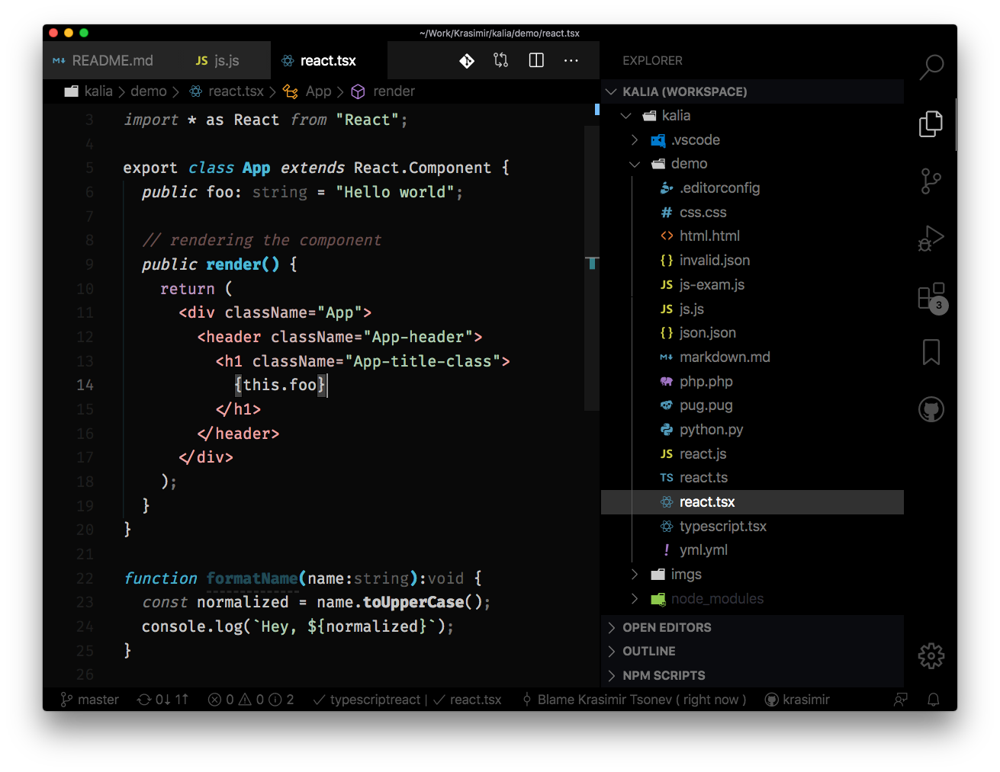

# Kalia

Kalia is a [VSCode](https://code.visualstudio.com/) extension/dark theme.

Here is what you get:

- Pastel colors near monochromic. Contextual syntax-highlighting.
- Balanced contrast. Carefully selected styling to help you focus on the code's flow.
- A tick line on the left showing the top function scope.

## Installation

- Get VSCode from [here](https://code.visualstudio.com/)
- Install, open and choose **Extensions** from menu
- Search for "Kalia"
- Click **Install** to install it
- Click **Reload** to reload the editor
- You can then access the theme from the menu bar click: Code > Preferences > Color Theme > Kalia

## Misc

- [Kalia in VSCode marketplace](https://marketplace.visualstudio.com/items?itemName=krasimir.kalia)

## How to develop the theme

Open VSCode and load the theme folder as a project folder. Then press F5 (Run -> Start debugging). The newly opened window is basically the preview of the theme. So, load some other project there. Change colors (themes/Kalia-color-theme.json) in the main window and see how they affect the code in the new window.
