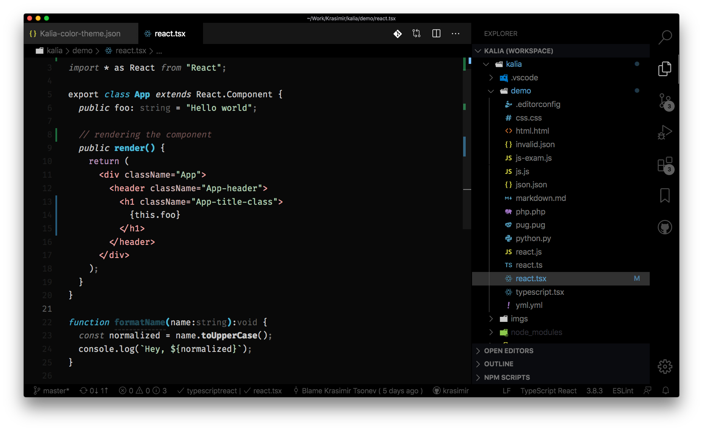

# Kalia

Kalia is a [VSCode](https://code.visualstudio.com/) theme for those of you that like dark themes. But it's not just about beautiful colors. Kalia is styling your code based on context. Think about a string. If it is used as a function argument is one color and if it is placed as a tag attribute is another.

Here are the main characteristics:

* Pastel colors near monochromic
* Balanced contrast
* Contextual colors

## Installation

* Get VSCode from [here](https://code.visualstudio.com/)
* Install, open and choose **Extensions** from menu
* Search for "Kalia Theme"
* Click **Install** to install it
* Click **Reload** to reload the editor
* You can then access the theme from the menu bar click: Code > Preferences > Color Theme > Kalia

## Misc

* [Kalia in VSCode marketplace](https://marketplace.visualstudio.com/items?itemName=krasimir.kalia)